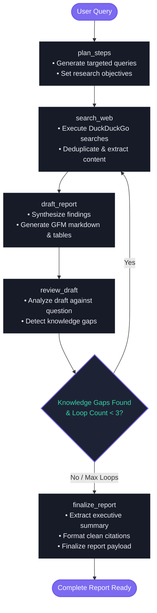
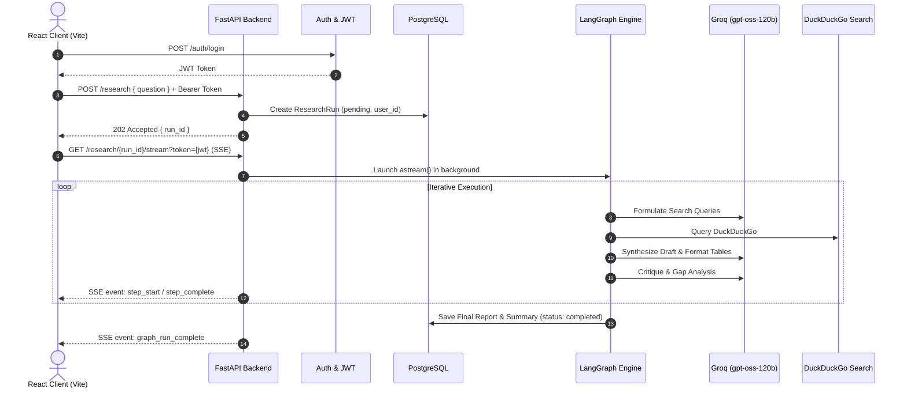

# 🔬 AI Research Assistant

<p align="center">
  <strong>An autonomous, multi-step agentic research system powered by LangGraph, Groq, FastAPI, and React.</strong>
</p>

<p align="center">
  <a href="#-architecture"></a>
  <a href="#-tech-stack"></a>
  <a href="#-backend-setup"></a>
  <a href="#-frontend-setup"></a>
  <a href="#-database"></a>
  <a href="LICENSE"></a>
</p>

---

## 📑 Overview

The **AI Research Assistant** is an autonomous investigation engine designed to synthesize in-depth, verified research reports on complex topics. Instead of producing single-pass superficial summaries, the agent executes an **iterative reflection loop**:

1. **Strategic Planning:** Deconstructs complex queries into targeted search vectors.
2. **Deep Information Gathering:** Executes concurrent DuckDuckGo searches to collect real-time web content.
3. **Draft Synthesis:** Formulates structured sections with contextual citations and comparative tables.
4. **Self-Reflection & Gap Detection:** Critiques its own draft to spot missing sub-topics, unaddressed nuances, or weak evidence.
5. **Autonomous Refinement:** Dynamically searches for missing data and refines the draft until quality thresholds are met.
6. **Final Publishing:** Generates an executive summary (TL;DR), full cited report, and enables direct **PDF/Markdown export**.

---

## 🏗 System Architecture

### 🔄 Agentic State Machine (LangGraph)

The core research loop is orchestrated via a directed acyclic & cyclic graph with conditional state transitions:



---

### 🌐 End-to-End Communication Flow



---

## 🌟 Key Capabilities

* **Iterative Self-Correction:** The agent does not stop at the first search. It actively evaluates its draft against the original query to ensure complete coverage.
* **Real-time Server-Sent Events (SSE):** Front-end UI streams intermediate steps, live status badges, search queries, and timeline milestones as the graph executes.
* **Multi-Tenant User Isolation:** Full JWT authentication system with bcrypt password hashing and user-isolated research history.
* **Smart Table Formatting:** Custom markdown normalization engine to ensure dynamically generated AI markdown tables render cleanly without glued pipes or broken layouts.
* **One-Click PDF Publishing:** Instant export of styled A4 reports featuring custom typography, executive TL;DR callouts, and clean bibliographic citations via native browser rendering engines.
* **Zero Cost Search:** Integrated directly with DuckDuckGo for fast, real-time web retrieval without requiring paid search API keys.

---

## 🛠 Tech Stack & Infrastructure

| Domain | Technology | Description |
|---|---|---|
| **Agent Orchestration** | [LangGraph](https://github.com/langchain-ai/langgraph) (0.2+) | Stateful multi-actor agent orchestration |
| **LLM Inference** | [Groq](https://groq.com/) Cloud | High-speed inference for `openai/gpt-oss-120b` |
| **Search Engine** | `ddgs` (DuckDuckGo) | Real-time web scraping and document search |
| **Backend Framework** | [FastAPI](https://fastapi.tiangolo.com/) | Async Python web framework with auto OpenAPI docs |
| **Database & ORM** | [PostgreSQL](https://www.postgresql.org/) + [SQLAlchemy](https://www.sqlalchemy.org/) | Async database access via `asyncpg` with migrations |
| **Authentication** | `PyJWT` + `bcrypt` | Stateless bearer token authentication & password hashing |
| **Frontend Framework** | [React 18](https://react.dev/) + [Vite](https://vitejs.dev/) | High-performance SPA with modern dark aesthetic |
| **Markdown Engine** | `react-markdown` + `remark-gfm` | GitHub-flavored markdown with table support |

---

## 🚀 Getting Started

### 1. Clone the Repository
```bash
git clone https://github.com/samjanjua6/Ai-Research-Assistant.git
cd Ai-Research-Assistant
```

### 2. Environment Configuration
Create a `.env` file in the project root or inside `backend/`:

```env
# ── Groq LLM Settings ──────────────────────────────────────
GROQ_API_KEY=gsk_your_groq_api_key_here
GROQ_MODEL=openai/gpt-oss-120b

# ── PostgreSQL Database ────────────────────────────────────
POSTGRES_USER=postgres
POSTGRES_PASSWORD=your_secure_password
POSTGRES_DB=research_helper
POSTGRES_HOST=localhost
POSTGRES_PORT=5432

# ── Security & App Settings ────────────────────────────────
JWT_SECRET_KEY=your_super_secret_jwt_key_here_generate_random
JWT_ALGORITHM=HS256
JWT_EXPIRE_MINUTES=10080
APP_ENV=production
LOG_LEVEL=INFO
```

---

### 3. Backend Setup

```bash
# Navigate to backend directory
cd backend

# Create and activate virtual environment
python -m venv venv

# Windows:
.\venv\Scripts\activate
# Linux / macOS:
source venv/bin/activate

# Install dependencies
pip install -r requirements.txt

# Start FastAPI server
uvicorn app.main:app --reload --host 0.0.0.0 --port 8000
```

---

### 4. Frontend Setup

```bash
# Navigate to frontend directory
cd frontend

# Install Node dependencies
npm install

# Start Vite development server
npm run dev
```

Visit **`http://localhost:5173`** to access the research assistant.

---

### 5. Running with Docker (Alternative)

```bash
# Start PostgreSQL container
docker-compose up -d
```

---

## 📚 API Reference

### 🔐 Authentication

| Method | Endpoint | Description | Auth Required |
|---|---|---|:---:|
| `POST` | `/auth/signup` | Register new user account (`name`, `email`, `password`, `terms_accepted`) | ❌ |
| `POST` | `/auth/login` | Log in and receive 7-day access token | ❌ |
| `GET` | `/auth/me` | Retrieve profile of authenticated user | ✅ Bearer |
| `GET` | `/auth/terms` | Fetch system terms & AI usage policies | ❌ |

### 🔬 Research Execution

| Method | Endpoint | Description | Auth Required |
|---|---|---|:---:|
| `POST` | `/research` | Initiate research query and start agent loop | ✅ Bearer |
| `GET` | `/research` | List past research runs for current user | ✅ Bearer |
| `GET` | `/research/{id}` | Get specific run status, steps, and final report | ✅ Bearer |
| `GET` | `/research/{id}/stream` | SSE streaming endpoint for real-time updates | ✅ `?token=` / Bearer |
| `POST` | `/research/{id}/stop` | Abort a running research execution | ✅ Bearer |
| `GET` | `/health` | Server health check and model diagnostics | ❌ |

Interactive Swagger documentation is available at **`http://localhost:8000/docs`**.

---

## 📂 Project Structure

```
Ai-Research-Assistant/
├── backend/
│   ├── app/
│   │   ├── agent/             # LangGraph state machine, nodes, and search tools
│   │   │   ├── graph.py       # Compiled state graph & conditional logic
│   │   │   ├── nodes.py       # Plan, search, draft, review, finalize nodes
│   │   │   ├── state.py       # GraphState TypedDict definition
│   │   │   └── tools.py       # DuckDuckGo search integration
│   │   ├── api/               # FastAPI route controllers
│   │   │   ├── auth.py        # Signup, login, terms handlers
│   │   │   ├── deps.py        # get_current_user dependency (header & query param)
│   │   │   └── routes.py      # /research lifecycle & SSE streaming
│   │   ├── core/              # Configuration, logging & security
│   │   │   ├── config.py      # Pydantic Settings
│   │   │   ├── logging.py     # Structured logger
│   │   │   └── security.py    # bcrypt & PyJWT implementation
│   │   ├── db/                # Database layer
│   │   │   ├── crud.py        # User & ResearchRun database operations
│   │   │   ├── database.py    # Async SQLAlchemy engine
│   │   │   └── models.py      # ORM Models (User, ResearchRun, StepLog)
│   │   └── main.py            # App entrypoint & static client mount
│   └── requirements.txt       # Python dependencies
├── frontend/
│   ├── src/
│   │   ├── api/               # Axios/Fetch client with auth interceptors
│   │   ├── components/        # React components (Header, AuthModal, ReportPanel, etc.)
│   │   ├── context/           # AuthContext (state & session management)
│   │   ├── hooks/             # useResearch custom hook
│   │   ├── App.jsx            # Main application layout
│   │   └── index.css          # Dark-theme design tokens & custom styling
│   ├── index.html             # HTML root template
│   ├── package.json           # Frontend dependencies
│   └── vite.config.js         # Vite configuration
├── docker-compose.yml         # Container orchestration for PostgreSQL
├── .gitignore                 # Secure gitignore for keys, environments, builds
└── README.md                  # Project documentation
```

---

## 🤝 Contributing

Contributions, issues, and feature requests are welcome! Feel free to check the [issues page](https://github.com/samjanjua6/Ai-Research-Assistant/issues).

1. Fork the Project
2. Create your Feature Branch (`git checkout -b feature/AmazingFeature`)
3. Commit your Changes (`git commit -m 'Add some AmazingFeature'`)
4. Push to the Branch (`git push origin feature/AmazingFeature`)
5. Open a Pull Request

---

## 📄 License

Distributed under the **MIT License**. See `LICENSE` for more information.
